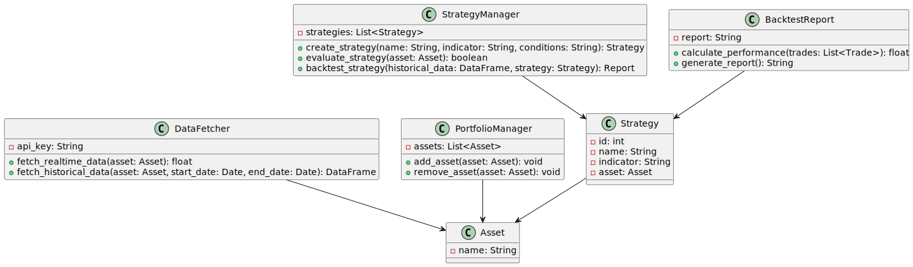

# Trading Platform Project

## Описание проекта

Данный проект представляет собой платформу для трейдинга, которая позволяет пользователям отслеживать цены на активы, строить персонализированные торговые стратегии на основе технических индикаторов и получать уведомления при изменении рыночных условий, соответствующих их стратегиям. Пользователи могут формировать свои портфели активов, использовать исторические данные для тестирования стратегий (backtesting) и анализировать рыночные тренды через графики. Реализация API взаимодействует с внешними источниками данных для получения актуальных котировок активов в реальном времени.

Цель проекта – предоставить пользователям удобный и эффективный инструмент для управления своими инвестициями с возможностью настройки автоматических стратегий.

### Автор - Трубчик Тимофей Николаевич, студент Б05-252 группы.

## Реализуемый функционал

### Основные функции:
1. **Управление портфелем**:
   - Добавление и удаление активов в портфель.
   - Отображение текущих цен активов и их изменений.
   - Визуализация динамики цен с помощью графиков.

2. **Создание и управление торговыми стратегиями**:
   - Настройка стратегий на основе технических индикаторов (скользящие средние, RSI, Bollinger Bands).
   - Ввод условий для покупки/продажи активов. (Функционала самой продажи/покупки в приложении не будет)

3. **Уведомления о рыночных изменениях**:
   - Отправка уведомлений при выполнении условий стратегии.
   - Возможность настройки типа уведомлений.

4. **Тестирование стратегий на исторических данных**:
   - Загрузка исторических данных для тестирования стратегий (backtesting).
   - Анализ эффективности стратегии на основании исторической динамики.

## Архитектура

### Классы:

#### 1. **DataFetcher**
   - **Описание**: Получает данные о ценах активов через API.
   - **Атрибуты**:
     - `api_key` - ключ для API.
   - **Методы**:
     - `fetch_realtime_data(asset)` – получение текущей цены актива.
     - `fetch_historical_data(asset, start_date, end_date)` – исторические данные.

#### 2. **PortfolioManager**
   - **Описание**: Управляет активами пользователя в портфеле.
   - **Атрибуты**:
     - `assets` - активы.
   - **Методы**:
     - `add_asset(asset)` – добавление актива.
     - `remove_asset(asset)` – удаление актива.

#### 3. **StrategyManager**
   - **Описание**: Управляет пользовательскими стратегиями.
   - **Атрибуты**:
     - `strategies` - стратегии.
   - **Методы**:
     - `create_strategy(name, indicator, conditions)` – создание стратегии.
     - `evaluate_strategy(asset)` – выполнение стратегии.
     - `backtest_strategy(historical_data, strategy)` – проверка стратегии.

#### 4. **BacktestReport**
   - **Описание**: Создает отчет о проверке
   - **Атрибуты**:
     - `report` - отчет.
   - **Методы**:
     - `calculate_performance(trades)` – просчет прибыли.
     - `generate_report()` – созддание отчета.

#### 5. **Asset**
   - **Описание**: Класс актива
   - **Атрибуты**:
     - `name` - название актива.

#### 6. **Strategy**
   - **Описание**: Класс стратегии
   - **Атрибуты**:
     - `id` - id.
     - `name` - название стратегии.
     - `indicator` - индикатор выполнения.
     - `asset` - актив.

## Используемые библиотеки

1. **Pandas**
   - Для обработки и анализа данных, таких как исторические котировки активов, а также для работы с таблицами и временными рядами.

2. **Matplotlib**
   - Для визуализации данных, построения графиков и отображения динамики цен на активы.

3. **Requests** (или же FastAPI)
   - Для выполнения HTTP-запросов к внешним API для получения актуальных и исторических данных о ценах активов.

4. **TA-Lib**
   - Для вычисления технических индикаторов, таких как скользящие средние, RSI, Bollinger Bands и других.

5. **Sched**
   - Для создания и управления расписанием уведомлений о рыночных изменениях.

6. **Json**
   - Для работы с данными, полученными от API в формате JSON, и их сериализации/десериализации.

7. **Datetime**
   - Для работы с временными интервалами, датами, и временем.

## Алгоритмы

1. **Алгоритм создания и выполнения стратегии**:
   - Пользователь создает стратегию, выбирая актив, индикатор и условия.
   - Приложение получает данные через API и применяет стратегию.
   - При выполнении условий отправляется уведомление.

2. **Алгоритм тестирования стратегии (backtesting)**:
   - Пользователь выбирает стратегию и временной интервал.
   - Приложение выполняет тестирование на исторических данных.

## Установка и запуск

# Будет добавлено позже

## UML диаграмма

